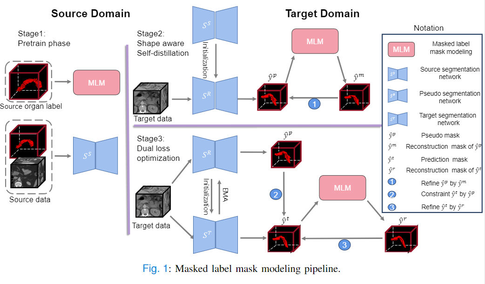

# MLM Segmentation

Learning to In-paint: Domain Adaptive Shape Completion for 3D Organ Segmentation

## Overview

Shape information is a strong and valuable prior in segmenting organs in medical images. In this project, we aim at modeling shape explicitly and using it to help medical image segmentation. 

 Variational Autoencoder (VAE) can learn the distribution of shape for a particular organ. Based on this, we propose a new unsupervised domain adaptation pipeline based on a pseudo loss and a VAE reconstruction loss under a teacher-student learning paradigm. Our method is validated on three public datasets (one for source domain and two for target domain) and two in-house datasets (target domain).

The example above is a case of unsupervised domain adaptation from [NIH pancreas](https://wiki.cancerimagingarchive.net/display/Public/Pancreas-CT) (source) to [MSD pancreas](http://medicaldecathlon.com/) (target). Our method outperforms other methods by fitting the predicted masks into a proper shape.

## Method

The overall pipeline of our VAE pipeline is demonstrated as follows.

## Environment and Data Preparation

This codebase generally works for python>=3.8

Please install the dependencies: `pip install -r requirements.txt`

First, you can get access to the three public datasets used in our paper here:

- NIH Pancreas-CT Dataset: [https://wiki.cancerimagingarchive.net/display/Public/Pancreas-CT](https://wiki.cancerimagingarchive.net/display/Public/Pancreas-CT)

- Medical Segmentation Decathlon (MSD): [http://medicaldecathlon.com/](http://medicaldecathlon.com/)

- Synapse Dataset: [https://www.synapse.org/#!Synapse:syn3193805/wiki/217789](https://www.synapse.org/#!Synapse:syn3193805/wiki/217789)

Next, run `data/data_preprocess.py` to preprocess the image and generate `.npy` files. Please be careful to modify the path of images and labels. 

All the preprocessed data should be put in a json file with the same format as we have given in file `data/Multi_all.json`.

## Training and Evaluation

The training scripts can be found in the folder `scripts/`. 

First, run script `bash scripts/source/mae_nih.bash <GPU-number>` and `bash scripts/source/seg_nih.bash` to train the VAE network and the segmentation network on the source domain.

On the target domain, use command `bash scripts/target/<script_name> <GPU-number>` run scripts for different tasks.

|       Script name       |                  Function                   |
| :---------------------: | :-----------------------------------------: |
|   domainseg_msd.bash    | Domain adaptation with reconstruction loss. |
| domainseg_msd_load.bash |  Domain adaptation with our MAE pipeline.   |

## Citation

If you use this code for your research, please cite our paper. 

## Acknoledgement

This work was supported by the Fundamental Research Funds for the Central Universities.

